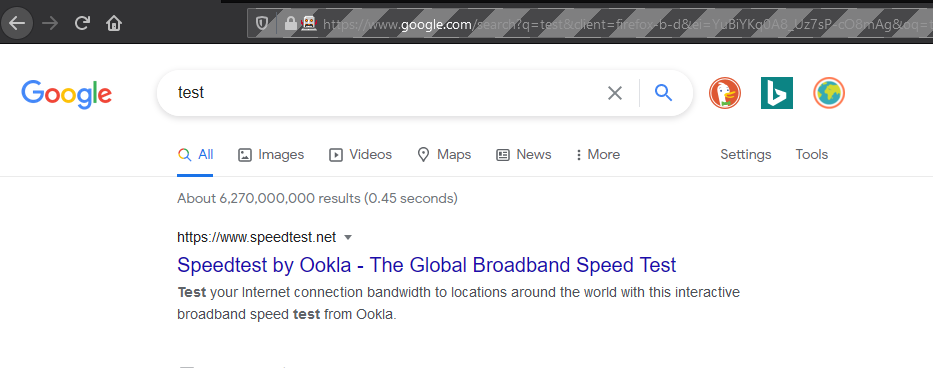
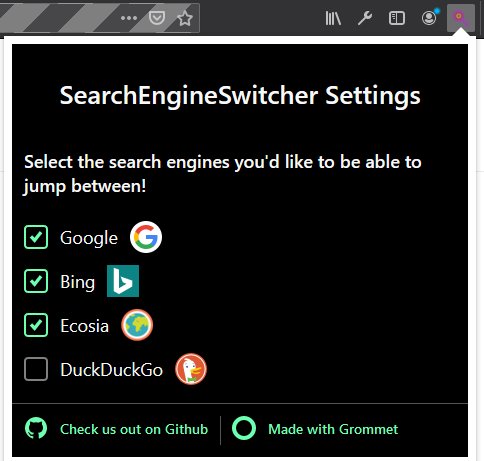

# SearchEngineSwitcher

This is a web extension, built for Chrome and Firefox, allowing users to more easily switch between search engines by embedding links between them.
The following search engines are supported currently:
 - Google
 - DuckDuckGo
 - Ecosia
 - Bing

It contains a content_script, responsible for embedding links to the other enabled search engines when the user is browsing on one of the enabled search engines. Here's a picture of what the embedded links look like on Google, as an example. The extension adds clickable icons to the other search engines to the right of the search area.

The extension also contains a popup, where users can toggle which of the supported search engines are enabled. Here it is in darkmode!

## Local Development
In order to develop on this extension locally
 1. Install the npm dependencies via `npm install` or `npm ci`.
 2. Ensure you have [Firefox Developer Edition](https://www.mozilla.org/en-US/firefox/developer/) installed in the directory specified in `web-ext.config.js`. Or, update `web-ext.config.js` to point to your chosen Firefox executable. NB: I will look to improve this step in future.
 3. Test the extension via `npm run dev:firefox`, which initiates a webpack-watch and invokes `web-ext run`.
 4. To generate the release artifacts locally, run `npm run dev:release` and look in the newly-created `/release` folder.

---
If you have an issues using the extension, or would like to make a feature request, feel free to raise an issue and I will get to it ASAP!
This README is a work in progress and will see more love soon!